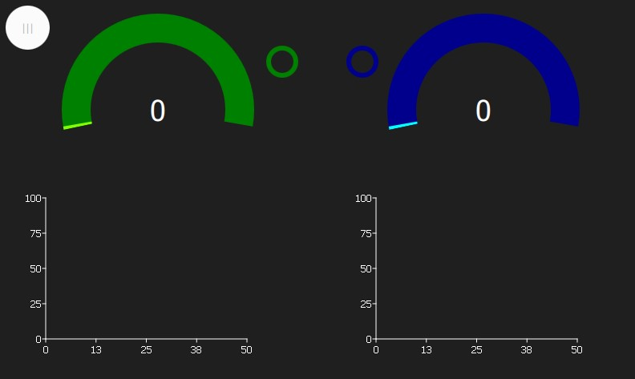

# EEG-Based Serious Game UI for Attention Control Improvement

Welcome to the EEG-Based Serious Game UI project! This repository focuses on the user interface (UI) design for an innovative EEG-based serious game aimed at enhancing attention control. This project is part of a larger initiative by [KTU METAM](https://www.ktu.edu.tr/metam) to harness the potential of EEG technology for creating serious games with real-world applications.

## Project Overview

The primary goal of this project is to develop a user-friendly and engaging UI for a serious game that uses EEG data to improve attention control. The game is designed for players of all ages and offers a dynamic and challenging experience. It leverages EEG hardware to collect data on players' brain signals and uses this information to control in-game elements, specifically, toy race cars on a track.

 

## Key Features

- **Real-time EEG data analysis**: The UI provides real-time feedback on the player's attention levels, creating an immersive experience.
- **Personalized gaming experience**: The game tailors itself to the individual's attention control needs, making it suitable for diverse user profiles.
- **Progress tracking**: The UI allows players to monitor their attention improvement over time, providing motivation and measurable results.
- **Educational and therapeutic potential**: This serious game can be used for training medical professionals, educating patients, and rehabilitating individuals with disabilities, with a focus on attention control improvement.

## Use Cases

This EEG-based serious game can be applied in various scenarios, including:

- **ADHD intervention**: Tailored gameplay experiences for children with ADHD, offering valuable feedback and guidance to improve their attention control.
- **General attention improvement**: A fun and challenging tool for anyone seeking to enhance their attention, focus, and goal-directed behavior.
- **Measurement and progress tracking**: For professionals and individuals interested in quantifying the effectiveness of attention control training.

## License

This project is licensed under the [MIT License](LICENSE). Feel free to use, modify, and distribute the code in accordance with the license terms.